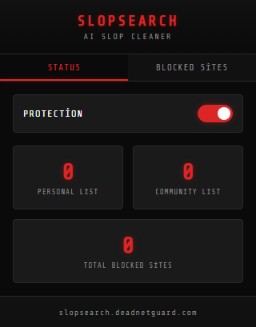
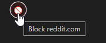
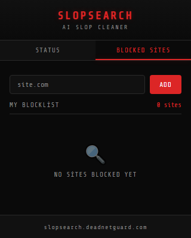

<p align="center">
  
</p>

<h1 align="center">SlopSearch</h1>

<p align="center">
  <strong>Search is full of slop. We're cleaning it up.</strong>
</p>

<p align="center">
  <a href="https://slopsearch.deadnetguard.com">
    
  </a>
  <a href="LICENSE">
    
  </a>
  <a href="https://github.com/Hikan-Teki/deadnetguard">
    
  </a>
</p>

---

## The Problem

AI-generated SEO spam is flooding search results:

- **Recipe sites** with 2000-word life stories before "boil water"
- **How-to guides** that say nothing in 15 paragraphs
- **Listicles** generated by GPT with zero original thought
- **Content farms** pumping out AI slop for ad revenue

Google and Bing won't fix this. So we did.

---

## Screenshots

<p align="center">
  
  <br>
  <em>Extension popup - your command center</em>
</p>

<p align="center">
  
  <br>
  <em>One-click blocking in search results</em>
</p>

<p align="center">
  
  <br>
  <em>Manage your blocked sites</em>
</p>

---

## Features

### Community-Powered Protection
Sites reported by other users are automatically filtered from your results. The more we use it, the cleaner everyone's search becomes.

### One-Click Blocking
See AI slop in your search results? Click the block button. Done. You'll never see that domain again.

### Personal Blocklist
Your personal blocks stay with you. Sync across devices, export anytime.

### Privacy Focused
No personal data collection. No tracking. Your blocklist is yours.

### Google & Bing Support
Works on both major search engines. More coming soon.

### Fast & Lightweight
Runs in the background without slowing down your browsing.

---

## Installation

### Chrome Web Store
*Coming soon*

### Manual Installation (Developer Mode)

1. Clone the repository:
```bash
git clone https://github.com/Hikan-Teki/slop-search.git
cd slop-search
```

2. Build the extension:
```bash
cd extension
npm install
npm run build
```

3. Load in Chrome:
   - Go to `chrome://extensions/`
   - Enable "Developer mode"
   - Click "Load unpacked"
   - Select the `extension/dist` folder

---

## Usage

1. **Install** the extension
2. **Search** on Google or Bing as usual
3. **Block** any AI slop site with one click
4. **Enjoy** cleaner search results

Your blocks are shared with the community (anonymously) to help everyone.

---

## Tech Stack

### Extension
| Technology | Purpose |
|------------|---------|
| React 18 | UI Framework |
| TypeScript | Type Safety |
| Vite + CRXJS | Build Tool |
| Zustand | State Management |
| Chrome Extensions API | Manifest V3 |

### Backend
| Technology | Purpose |
|------------|---------|
| Node.js | Runtime |
| Express | Web Framework |
| PostgreSQL | Database |
| Prisma | ORM |

---

## Project Structure

```
slop-search/
├── extension/           # Chrome Extension
│   ├── src/
│   │   ├── content/     # Content scripts (DOM manipulation)
│   │   ├── background/  # Service worker
│   │   ├── popup/       # React popup UI
│   │   └── stores/      # Zustand stores
│   └── manifest.json
│
├── backend/             # API Server
│   ├── src/
│   │   ├── routes/      # Express routes
│   │   ├── controllers/ # Business logic
│   │   └── middleware/  # Auth, rate limiting
│   └── prisma/
│
├── website/             # Landing Page
└── assets/              # Logos & screenshots
```

---

## API Endpoints

| Method | Endpoint | Description |
|--------|----------|-------------|
| GET | `/api/blocklist` | Get community blocklist |
| GET | `/api/blocklist/count` | Get total blocked sites count |
| POST | `/api/report` | Report a slop site |
| POST | `/api/vote` | Vote on reported sites |
| DELETE | `/api/blocklist/:id` | Remove your own report |

---

## Self-Hosting

Want to run your own backend?

```bash
cd backend
npm install
cp .env.example .env
# Edit .env with your database credentials
npx prisma migrate deploy
npm start
```

---

## Contributing

We welcome contributions:

1. **Report AI slop sites** - Use the extension!
2. **Code contributions** - PRs welcome
3. **Bug reports** - Open an issue

---

## Privacy

- No personal data collection
- Anonymous fingerprinting for vote deduplication only
- No browsing history tracked
- Open source - verify yourself

See [Privacy Policy](https://slopsearch.deadnetguard.com/privacy.html) for details.

---

## Related Projects

- [DeadNetGuard](https://github.com/Hikan-Teki/deadnetguard) - Clean AI slop from YouTube

---

## License

MIT License - see [LICENSE](LICENSE) for details.

---

<p align="center">
  <strong>The internet is dying. AI slop is killing it. We're fighting back.</strong>
  <br><br>
  <a href="https://slopsearch.deadnetguard.com">Website</a> •
  <a href="https://github.com/Hikan-Teki/slop-search/issues">Report Bug</a> •
  <a href="https://deadnetguard.com">DeadNetGuard</a>
</p>
